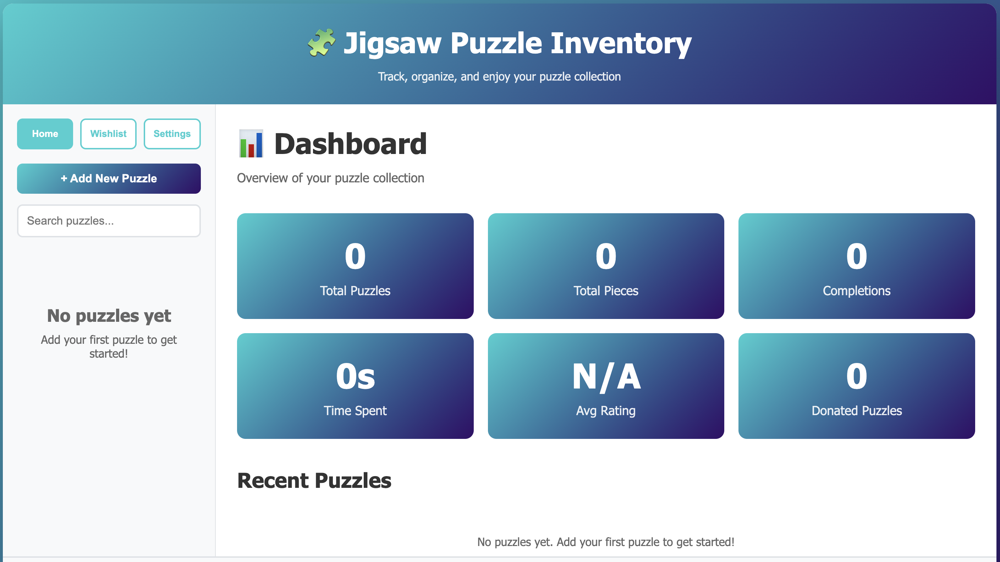

# 🧩 Puzzle Inventory App

A web-based inventory system for tracking jigsaw puzzles. Runs on Node.js with a simple Express server and stores everything as JSON files — no database needed.

**Version:** SEHv1.02

---



---

## Quick Start

```bash
npm install
npm start
```

Open [http://localhost:3000](http://localhost:3000) in a browser. That's it.

---

## Deploying on Linux (recommended)

If you want it to run automatically on boot and survive reboots, use the included install script. It sets up a systemd service:

```bash
sudo bash install.sh
```

After that, manage it with:

```bash
sudo systemctl status puzzle-inventory    # is it running?
sudo systemctl stop puzzle-inventory      # stop
sudo systemctl start puzzle-inventory     # start
sudo journalctl -u puzzle-inventory       # view logs
```

---

## Features

- **Puzzle management** — add, edit, delete with name, brand, piece count, theme, series/set, location, and source
- **Image gallery** — upload multiple images per puzzle, set a thumbnail, replace or delete individual images. All images are automatically resized to 1200px max and compressed on upload.
- **Completion logs** — log each time you finish a puzzle with the date, how long it took, and notes. Edit or delete any log entry.
- **Ratings** — 1–5 star rating per puzzle
- **Puzzle Quality Index (PQI)** — a 10-metric scoring system (0–100) for a more detailed quality assessment
- **Status flags** — condition (new/used), passes pickup test, missing pieces, puzzle dust level, donated
- **Wishlist** — keep a list of puzzles you want to get
- **Custom fields** — add any extra key/value fields per puzzle
- **Search and filter** — find puzzles by name, brand, theme, or series
- **Statistics dashboard** — completion counts, average solve times, ratings at a glance
- **Backup and restore** — export all puzzle data (not images) to a JSON file from the settings page, and restore from one later
- **Themeable** — pick custom primary/secondary colors for the UI
- **Managed dropdowns** — brands, themes, and series/sets are managed lists. Add new ones on the fly or edit the full list in settings.

---

## Project Structure

```
puzzle-inventory-app/
├── server.js                  # Express server — API endpoints, file I/O, image processing
├── package.json               # Node.js dependencies
├── install.sh                 # Linux systemd install script
├── puzzle-inventory.service   # systemd unit file (install.sh patches this automatically)
├── public/
│   ├── index.html             # The entire frontend UI
│   └── app.js                 # All frontend logic
├── data/                      # Created at runtime. Contains all user data.
│   ├── puzzles.json           # Puzzle database
│   ├── settings.json          # Brands, themes, series lists
│   ├── wishlist.json          # Wishlist items
│   └── theme.json             # UI color theme
└── uploads/
    └── puzzles/               # All uploaded puzzle images
```

**None of the files in `data/` or `uploads/` are tracked by git.** These are your personal data. Back them up separately — the app has a built-in backup feature for the JSON data, but images need to be copied manually (just grab the `uploads/` folder).

---

## Requirements

- Node.js 18 or later
- npm

---

## API Reference

All endpoints return JSON. Errors come back as `{ error: "message" }` with an appropriate HTTP status code.

### Puzzles

| Method | Endpoint | Description |
|--------|----------|-------------|
| GET | `/api/puzzles` | List all puzzles |
| GET | `/api/puzzles/:id` | Get one puzzle |
| POST | `/api/puzzles` | Create a puzzle (name and pieces required) |
| PUT | `/api/puzzles/:id` | Update a puzzle |
| DELETE | `/api/puzzles/:id` | Delete a puzzle and its images |

### Images

| Method | Endpoint | Description |
|--------|----------|-------------|
| POST | `/api/puzzles/:id/images` | Upload one or more images (multipart, field name `images`) |
| DELETE | `/api/puzzles/:id/images/:index` | Delete an image by index |
| PUT | `/api/puzzles/:id/thumbnail` | Set which image is the thumbnail |

### Completion Logs

| Method | Endpoint | Description |
|--------|----------|-------------|
| POST | `/api/puzzles/:id/logs` | Add a log entry (date and time required) |
| PUT | `/api/puzzles/:id/logs/:logId` | Edit a log entry |
| DELETE | `/api/puzzles/:id/logs/:logId` | Delete a log entry |

### Puzzle Fields (updated individually from the detail view)

| Method | Endpoint | Body |
|--------|----------|------|
| PUT | `/api/puzzles/:id/notes` | `{ notes }` |
| PUT | `/api/puzzles/:id/condition` | `{ condition }` |
| PUT | `/api/puzzles/:id/passes-pickup` | `{ passesPickup }` |
| PUT | `/api/puzzles/:id/missing-pieces` | `{ missingPieces }` |
| PUT | `/api/puzzles/:id/puzzle-dust` | `{ puzzleDust }` |
| PUT | `/api/puzzles/:id/donated` | `{ donated }` |
| PUT | `/api/puzzles/:id/quality` | `{ ...quality metrics }` |
| PUT | `/api/puzzles/:id/pqi` | `{ ...PQI data }` |

### Custom Fields

| Method | Endpoint | Description |
|--------|----------|-------------|
| POST | `/api/puzzles/:id/custom-fields` | Add a custom field (name and value required) |
| DELETE | `/api/puzzles/:id/custom-fields/:fieldId` | Delete a custom field |

### Wishlist

| Method | Endpoint | Description |
|--------|----------|-------------|
| GET | `/api/wishlist` | List all wishlist items |
| POST | `/api/wishlist` | Add an item (name required) |
| PUT | `/api/wishlist/:id` | Update an item |
| DELETE | `/api/wishlist/:id` | Delete an item |

### Settings & Theme

| Method | Endpoint | Description |
|--------|----------|-------------|
| GET | `/api/settings` | Get settings (brands, themes, series lists) |
| PUT | `/api/settings` | Save settings |
| GET | `/api/theme` | Get UI theme colors |
| PUT | `/api/theme` | Save UI theme colors |

---

## Changelog

### SEHv1.02 — 2026-03-11
**Bug fixes:**
- Completion log ratings were always saved as 0 — star rating input is now wired up correctly for both new logs and the initial log on puzzle creation
- Added missing star rating UI to the completion log modal and initial log section
- Rating is now correctly restored when editing an existing log entry
- Custom fields always failed with a 400 error — server was expecting a field named `label` but the client was sending `name`; both sides now use `name`
- Thumbnail index could go out of bounds after deleting an image (especially if the deleted image came before the thumbnail); server now clamps the index after deletion, and the client renders defensively as well
- Image upload errors were silently treated as success; the handler now checks the response status and shows an error alert on failure
- XSS: added `escapeHtml()` and applied it to all user-supplied data rendered into the page (puzzle names, brands, themes, notes, custom field values, wishlist fields, etc.)
- Wishlist product links are now only rendered as clickable anchors if the URL starts with `http://` or `https://`, preventing `javascript:` URL injection
- Image gallery onclick handlers no longer inject image URLs directly into HTML attribute strings; they now use index-based lookup to avoid attribute injection

**New features:**
- Dark mode toggle added to Settings → Theme section; preference is saved in `localStorage` and persists across sessions

### SEHv1.01 — initial release
- Initial public release
